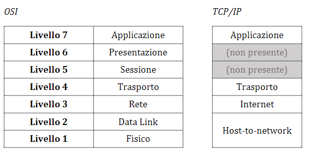
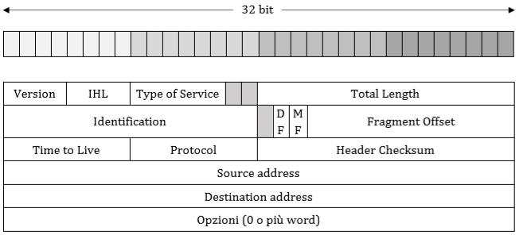

# Appunti Architettura Reti

**Di:** Antonio Strippoli

**Basati su:**

* Le slide del prof Osvaldo Gervasi
* Reti di Calcolatori (A. Tanenbaum)

**Revisore:** Alessio Amatucci

> Degli appunti per domarli, degli appunti per trovarli, degli appunti per ghermirli e nel buio incatenarli

## Obiettivi

L’obiettivo principale dei presenti appunti è la preparazione personale alla disciplina “Architettura Reti” insegnata dal prof. Osvaldo Gervasi dell’Università di Perugia.

Non conoscendo nulla riguardo l’architettura di una rete ed i suoi protocolli, il materiale reso disponibile dal docente (slides) si è rivelato insufficiente per un ripasso o uno studio nei casi in cui non sia stato presente a lezione. Anche altri appunti resi gentilmente disponibili da altri studenti non si sono rivelati chiari in molti punti.

Per cui, l’obiettivo di questi appunti è fornire una buona visione d’insieme di ogni argomento presente nel programma 2019/20 di Architettura Reti, tenendo a mente che il lettore potrebbe non aver mai letto nulla riguardo la suddetta materia e fornendo quindi anche definizioni basilari e spiegazioni base.

Ove opportuno, alcuni argomenti sono presentati in forma anche leggermente più estesa solamente a scopo di chiarimento. Tuttavia, altri argomenti sono particolarmente dettagliati e non tutti i dettagli sono ovviamente affrontati durante le lezioni. In questi casi, si è deciso di limitarsi ad una visione d’insieme più che sufficiente per la preparazione all’esame, ma che potrebbe non risultare esaustiva per gli studenti più curiosi. Questi argomenti sono singolarmente segnalati in ogni paragrafo qualora si volesse approfondire.

Inoltre, è bene segnalare che non viene trattato l’intero programma dell’anno 2019/2020, in quanto sono stati tralasciati i seguenti argomenti:

* Topologie di reti;
* Livello fisico/data link OSI (mezzi trasmissivi, ethernet, metodi di accesso al bus...);
* Frame Relay e ATM;
* VPN.

Si noti che è comunque possibile contribuire alla repository dedicata su GitHub ([https://github.com/CoffeeStraw/Appunti-Architettura-Reti](https://github.com/CoffeeStraw/Appunti-Architettura-Reti)) per ultimare e tenere aggiornati i presenti appunti, modificando il file .docx con cui sono stati scritti e rigenerando il .pdf utilizzato per la distribuzione.

## Indice

1. **Definizioni Generali**
    1. [Rete](#11-rete)
    2. [Internet](#12-internet)
    3. [Intranet](#13-intranet)
    4. [Extranet](#14-extranet)
    5. [ISP](#15-isp)
    6. [Protocollo](#16-protocollo)
    7. [Modello client/server](#17-modello-client/server)
    8. [Gateway](#18-gateway)
    9. [LAN](#19-lan)
    10. [MAN](110-MAN)
    11. [WAN](#111-WAN)
    12. [Servizio connection oriented](#112-servizio-connection-oriented)
    13. [Servizio connectionless](#113-servizio-connectionless)
    14. [Servizio best effort](#114-servizio-best-effort)
    15. [Quality of Service](#115-quality-of-service)
    16. [Unicasting, Multicasting e Broadcasting](#116-unicasting-multicasting-e-broadcasting)
    17. [RFC](#117-rfc)
2. **Le Architetture di Rete**
    1. [Il modello di riferimento ISO/OSI](#21-il-modello-di-riferimento-iso/osi)
    2. [Il modello di riferimento TCP/IP](#22-il-modello-di-riferimento-tcp/ip)
3. **Internet Protocol (IP)**
    1. [Datagram IP](#31-datagram-ip)
        1. [IPv4](#311-ipv4)

# 1 Definizioni Generali

## 1.1 Rete

Una **rete** è un insieme di dispositivi collegati in modo da permettere lo scambio di dati e la comunicazione tra più utenti. I dati vengono trasferiti sotto forma di **pacchetti** (a volte detti **PDU**, **Packet Data Unit**). 

Si distingue da un sistema distribuito, che invece appare ai propri utenti come un singolo sistema coerente. 

## 1.2 Internet

**Internet (o Internetwork)** è l’interconnessione di reti di varia natura che consente lo scambio di informazione rappresentata in forma digitale, cioè come sequenza di cifre binarie (bit).

Si può dire che **un computer è su Internet** se esegue la pila di protocolli TCP/IP, ha un indirizzo IP, e può spedire pacchetti IP a tutti gli altri computer su Internet (questi argomenti saranno trattati nei capitoli successivi).

## 1.3 Intranet

**Intranet** è un sistema telematico di collegamento effettuato con le stesse modalità di Internet, ma riservato a un circuito chiuso di utenti (all’interno di aziende, di strutture pubbliche, di organizzazioni di ricerca ecc.).

## 1.4 Extranet

L’**Extranet** è una Intranet estesa ad alcuni soggetti non operanti nella stessa rete (p.e. clienti, fornitori, consulenti).

## 1.5 ISP

Un **ISP (Internet Service Provider)** indica un’organizzazione o un’infrastruttura che mette a disposizione dei servizi inerenti a Internet per degli utenti, come la posta elettronica o l’accesso al World Wide Web.

## 1.6 Protocollo

Informalmente, un **protocollo** è un accordo, tra le parti che comunicano, sul modo in cui deve procedere la comunicazione. Violare il protocollo rende la comunicazione più difficile, se non del tutto impossibile.

Formalmente, un **protocollo** è un _insieme di regole_ che definisce l’interazione tra sistemi.

## 1.7 Modello client/server

Il **modello client/server** è un modello in cui sono presenti due entità (client e server), nel quale il client si connette al server mediante una rete, per la fruizione di un certo servizio (come la condivisione dati).

## 1.8 Gateway

Un gateway è un dispositivo di rete (generalmente un router) che collega due reti eterogenee. Il suo scopo principale è quello di veicolare i pacchetti di rete all’esterno di una rete locale.

## 1.9 LAN

Le **LAN (Local Area Network)** sono reti private installate all’interno di un singolo edificio o campus, con dimensione _fino a qualche Km_, ed hanno come scopo la condivisione di risorse (come stampanti) e lo scambio di informazioni.

## 1.10 MAN

Una **MAN (Metropolitan Area Network)** è una rete che copre un’intera città e collega più LAN geograficamente vicine. Di solito si tratta di singole filiali di un’azienda, che vengono connesse ad una MAN attraverso l’affitto di linee dedicate.

## 1.11 WAN

Una **WAN (Wide Area Network)** è una rete che copre un’area geograficamente estesa, spesso una nazione o un continente. Il numero di reti locali o singoli computer che si possono connettere ad una singola WAN è teoricamente illimitato.

## 1.12 Servizio connection oriented

Un servizio **connection oriented (orientato alla connessione)** è un servizio di rete in cui l’utente che lo vuole usare deve _stabilire una connessione_ (mediante la creazione di un circuito, che sia fisico o virtuale), _usarla_ e quindi _rilasciarla_. Nella maggior parte dei casi, l’ordine dei bit inviati è conservato e arrivano nella sequenza con cui sono stati trasmessi, che rende questa categoria di servizi **affidabile**.

Un’analogia utile per capire, è quella tra il servizio connection oriented e il **sistema telefonico**. Per parlare con qualcuno si deve prendere il telefono, comporre il numero, parlare e poi riagganciare.

## 1.13 Servizio connectionless

Un servizio **connectionless (senza connessione)** si contrappone al servizio con connessione e non viene quindi stabilita una connessione. I dati vengono instradati in maniera indipendente l’uno dall’altro, senza verificare che il destinatario sia raggiungibile e senza controllare che i dati arrivino nell’ordine desiderato, che rende questa categoria di servizi **inaffidabile**.

Un’analogia utile per capire, è quella tra il servizio connectionless e la **posta**. Ogni messaggio (lettera) trasporta l’indirizzo completo del destinatario ed è instradato attraverso il sistema postale in modo indipendente dagli altri. Normalmente, quando si mandano due messaggi alla stessa destinazione, il primo inviato è anche il primo ad arrivare; ma è possibile che incontri un ritardo, e quindi arrivi dopo il secondo.

## 1.14 Servizio best effort

Un servizio **best effort** (**massimo impegno**, interpretato “come va, va”) è un servizio inaffidabile che non offre alcuna garanzia di consegna dei pacchetti (alcuni di essi possono perdersi e avere bisogno di essere ritrasmessi, o andare fuori sequenza) né di controllo di errore, di flusso e di congestione.

## 1.15 Quality of Service

Il termine **Quality of Service** (abbreviato **QoS**) è utilizzato per indicare i parametri usati per caratterizzare la qualità del servizio offerto da una rete (ad esempio perdita di pacchetti, ritardo), o gli strumenti o tecniche per ottenere una qualità di servizio desiderata. Si contrappone al termine best effort.

## 1.16 Unicasting, Multicasting e Broadcasting

**Unicasting, Multicasting e Broadcasting** sono delle metodologie per la trasmissione dei dati. La distinzione avviene in base al numero dei ricevitori:

* Unicasting: trasmissione di dati tra un trasmettitore e un ricevitore (1-1);
* Multicasting: trasmissione di dati tra un trasmettitore ed un sottoinsieme di tutte le macchine della rete (1-n);
* Broadcasting: trasmissione di dati tra un trasmettitore e tutte le macchine della rete (1-tutti).

## 1.17 RFC

Gli **RFC (Request For Comment)**, sono una serie di rapporti tecnici numerati cronologicamente che riportano informazioni o specifiche riguardanti nuove ricerche, innovazioni e metodologie di Internet. Sono redatti da un organismo internazionale chiamato **IETF (Internet Engineering Task Force)**, e sono tutti consultabili su [www.ietf.org/rfc/](www.ietf.org/rfc/). 

# 2 Le Architetture di Rete

Esistono due importanti architetture di rete: il modello di riferimento **OSI** e il modello **TCP/IP**. Anche se i protocolli associati al modello OSI ormai sono in disuso, il modello in  sé ha valore generale ed è ancora valido, e le caratteristiche discusse per ogni livellosono ancora molto importanti. Il modello TCP/IP ha caratteristiche opposte: il modello in sé è poco utilizzabile, ma i protocolli sono largamente impiegati; per questo motivo vanno esaminati entrambi in dettaglio. A volte s’impara più dai fallimenti che dai successi.

## 2.1 Il modello di riferimento ISO/OSI

L’ISO (International Standards Organization) è un organo consulente dell’ONU, che promuove lo sviluppo di standardizzazioni nel mondo. È il creatore dell’**OSI** (**_Open Systems Interconnections_**), così chiamato perché riguarda la connessione di sistemi aperti, cioè sistemi che sono “aperti” verso la comunicazione con altri. È uno standard **_de jure_** ("per legge", ovvero formale, adottato da qualche organismo di standardizzazione autorizzato, in questo caso ISO). È caratterizzato da **7 livelli**: ogni livello sfrutta i servizi dei livelli inferiori. La comunicazione tra livelli adiacenti avviene tramite i **NAP (Neutral Access Points)**, mentre la comunicazione tra entità di livelli diversi avviene tramite il **SAP (Service Access Point)**. Le operazioni specifiche di un livello sono realizzate tramite un insieme di protocolli. Di seguito una breve descrizione di ogni livello:

**Physical Layer**: si occupa della trasmissione di bit grezzi sul canale di comunicazione. È l’insieme di regole che specificano le connessioni elettriche e fisiche tra i dispositivi. Definisce la specifica dei cavi e del tipo di segnale elettrico associato ai vari pin.

**Data Link Layer**: definisce l’accesso al mezzo specificato nel Physical Layer, il formato dei dati ed è responsabile dell’invio affidabile delle informazioni, ovvero gestisce tra le altre cose la frammentazione dei dati e le procedure di controllo di possibili errori del livello fisico. Appartengono a questo livello i protocolli Data Link (DLCP, BSC, HDLC...), sono inoltre presenti anche i sottolivelli LLC e MAC e hardware come Network Interface Card (NIC), Hub, Switch (di livello 2) e Bridge.

**Network Layer**: si occupa della connessione tra due nodi della rete (detti nodo sorgente e nodo destinatario). Gestisce il routing e lo scambio di informazione tra i nodi. I servizi associati a questo livello sono legati al movimento dei dati nella rete, inclusi l’indirizzamento, il routing e le procedure di controllo dei flussi (vengono definite le raccomandazioni X.25 e X.75). A questo livello appartiene il protocollo IP.

**Transport Layer**: è il garante del trasferimento delle informazioni. Analizza il traffico fra i nodi controllando gli errori, la sequenza e i fattori di affidabilità dello scambio. A questo livello appartengono i protocolli TCP e UDP. È il primo livello **end-to-end**.

**Session Layer**: regolarizza l’inizio e la fine dei flussi dei dati fra i nodi. Si occupa dell’organizzazione del dialogo tra i programmi applicativi.

**Presentation Layer**: si occupa di effettuare trasformazione sui dati compatibilmente con il dispositivo di ricezione. Esempi di trasformazione riguardano crittografia e compressione.

**Application Layer**: è l’ultimo livello, comprende tutti i programmi applicativi che consentono l’uso della rete: fa da interfaccia tra rete e utente. Esempi di funzioni svolte da questo livello possono essere: terminale virtuale, trasferimento di file, posta elettronica, condivisione di risorse e accesso a database.

## 2.2 Il modello di riferimento TCP/IP

Il **TCP/IP** è così chiamato per ricordare i suoi protocolli più importanti: il Transmission Control Protocol (TCP) e l'Internet Protocol (IP). È uno standard **_de facto_** ("dalla realtà", ovvero stabilito senza piani formali). Di seguito una breve descrizione di ogni livello:

**Host-to-network Layer**: “il grande vuoto”, nel modello di riferimento TCP/IP non viene specificato cosa accade in questo territorio, si limita a segnalare che l’host deve collegarsi alla rete usando qualche protocollo che gli permetta di spedire pacchetti IP. Questo protocollo però non è definito e varia da host a host.

**Internet Layer**: il suo scopo è quello di consentire agli host di mandare pacchetti in qualsiasi rete, e farli viaggiare in modo indipendente l’uno dall’altro fino alla destinazione (che magari è su una rete diversa). È importante notare che viene definito il protocollo **IP**.

**Transport Layer**: è progettato per consentire la comunicazione tra entità pari degli host sorgente e destinazione, come nel livello trasporto OSI. Sono definiti due protocolli di trasporto end-to-end: **TCP** e **UDP**.

**Application Layer**: nel modello TCP/IP non ci sono sessione e presentazione, poiché si è notato che nella maggior parte dei casi sono inutili. Come nel modello OSI, il livello Applicazione contiene un gran numero di programmi che si interfacciano con l’utente.

# 3 Internet Protocol (IP)

L’IP è la colla che tiene unito Internet. È il protocollo **connectionless** e **best effort** del livello 3 (Rete) e permette di interconnettere reti eterogenee: per questo è implementato sopra ai protocolli di livello Data Link, svolgendo la funzione di routing (ovvero scegliere il percorso che dovranno seguire i dati, spiegato in seguito).

## 3.1 Datagram IP

Il pacchetto utilizzato dall’IP è detto **datagram IP** (per analogia con il servizio telegrafico, telegram service) ed è costituita da una parte di intestazione (detta **header**) e da una parte di testo (detta **data**). La versione attualmente utilizzata è la v4, anche se al momento è in corso una transizione da IPv4 a IPv6, che ha avuto inizio anni fa e il cui completamento richiederà ancora parecchio tempo (o addirittura mai). Di seguito viene analizzato l’header dell’IPv4.

### 3.1.1 IPv4

L’intestazione ha una parte fissa di 20 byte e una parte opzionale di lunghezza variabile ed è trasmessa in ordine _big endian_ (da sinistra a destra). Sulle macchine _little endian_ è necessario eseguire una conversione software sia in ricezione che in trasmissione.

* **Version**: campo di 4 bit che indica la versione IP del datagram (attualmente IPv4);
*  **IHL (Internet Header Length)**: campo di 4 bit che indica la lunghezza dell’header espressa in parole da 32 bit. Necessario poiché, come anticipato, la lunghezza dell’intestazione non è costante;
* **Type of Service**: campo di 8 bit che indica come deve essere gestito il datagram;
* **Total Length**: campo lungo 16 bit che identifica la lunghezza totale del datagram; 
* **Identification, flag, offset**: controllano frammentazione e riassemblaggio del datagram; 
* **TTL (Time To Live)**: indica la durata in secondi concessa al datagram per restare in rete, evitando che un datagram giri a vuoto per sempre, evento che potrebbe accadere in caso di danneggiamento delle tabelle di routing;
* **Protocol**: è un codice che identifica il protocollo utilizzato nel campo dati (intuitivamente, può essere associato all’estensione nel nominativo di un file);
* **Header Checksum**: garantisce il controllo dell’integrità dell’header;
* **Source address, Destination address**: rispettivamente indirizzo sorgente e indirizzo di destinazione, indicano il numero di rete e il numero di host, espressi tramite indirizzi IP;
* **Options (opzioni)**: via di fuga per dare alle versioni successive del protocollo la possibilità d’includere informazioni non presenti nel progetto originale.  

